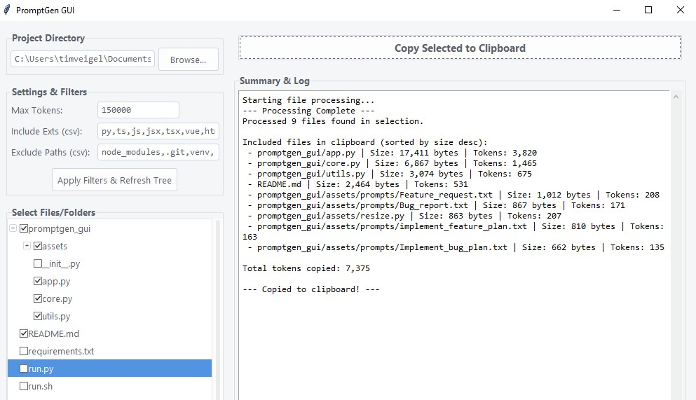

# PromptGen GUI
**WORK IN PROGRESS**

A simple but powerful desktop tool in the good old tkinter style. It allows you to easily select and deselect files form your repository to copy them to your clipboard, including the directory tree.
Attach the copied contents to the prompt you want to send your LLM of choice to quickly provide it with all necessary context.

[]

## Features

-   **Interactive File Tree:** Visually browse and select files and folders from your project.
-   **Persistent Selections:** Your checked items are remembered between refreshes and sessions.
-   **Smart Filtering:** Easily exclude common directories (`node_modules`, `.git`) and filter by file extensions.
-   **Token Aware:** Uses `tiktoken` to calculate token counts and automatically omits the largest files if the total exceeds a limit, ensuring the prompt fits within the context window.
-   **Automatic Directory Structure:** Generates a clean, tree-like structure of the selected files to give the LLM context.
-   **One-Click Copy:** Copies the formatted directory structure and file contents to the clipboard with a single button press.
-   **Cross-Platform:** Works on Windows, macOS, and Linux.

## Installation & Usage

You must have Python 3.8+ installed and available on your system's PATH.

1.  **Clone the repository:**
    ```bash
    git clone https://github.com/your-username/promptgen-gui.git
    cd promptgen-gui
    ```

2.  **Run the application:**
    -   **On Windows:** Double-click the `run.bat` file.
    -   **On macOS/Linux:** Make the script executable first, then run it.
        ```bash
        chmod +x run.sh
        ./run.sh
        ```

    The script will automatically create a local virtual environment (`venv` folder), install the required dependencies from `requirements.txt`, and launch the application.

## How to Use

1.  **Select a Directory:** Click "Browse..." to choose your project's root folder.
2.  **Filter (Optional):** Adjust the included extensions or excluded paths as needed. Click "Apply Filters & Refresh Tree".
3.  **Select Files:** Click the checkboxes next to the files and folders you want to include in the prompt.
4.  **Generate & Copy:** Click the "Copy Selected to Clipboard" button.
5.  **Paste:** Paste the result into your favorite LLM chat interface.


## License

This project is licensed under the MIT License - see the [LICENSE](LICENSE) file for details.
